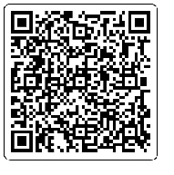

# 🤖 Reconhecimento Sono

## Visão Geral do Projeto

Este projeto é um sistema para detecção de sonolência em tempo real. Utilizando Visão Computacional, ele monitora o estado dos olhos através da webcam. Se os olhos permanecerem fechados por um período crítico (definido em `config.py`), um alarme sonoro é acionado.

### ⚙️ Tecnologias Principais

| Componente | Tecnologia | Função |
| :--- | :--- | :--- |
| **Detecção de Objetos** | Ultralytics YOLOv8 | Modelo de Deep Learning para identificar "Olho Aberto" e "Olho Fechado". |
| **Visão Computacional** | OpenCV (`cv2`) | Captura de vídeo, processamento de frames e desenho da interface (UI). |
| **Áudio/Alarme** | Pygame | Gerenciamento e reprodução do arquivo de som do alarme (`alarm.wav`). |
| **Ambiente** | Python 3.x | Linguagem de programação principal. |

-----


[](https://www.youtube.com/watch?v=qSFmMgFxDK8)

## 🚀 Instalação e Execução

As instruções a seguir pressupõem que você está na pasta raiz do projeto (`driver_drowsiness_ai/`).

### 1\. Criar e Ativar o Ambiente Virtual

É altamente recomendável utilizar um ambiente virtual para isolar as dependências do projeto:

```bash
# Navegue para a pasta do seu projeto (exemplo)
cd /home/kali/reconhecimentosono

# Crie o ambiente virtual
python3 -m venv venv

# Ative o ambiente virtual
source venv/bin/activate
```

### 2\. Instalar Dependências

Com o ambiente ativado (`(venv)` deve aparecer no seu terminal), instale todas as bibliotecas necessárias:

```bash
pip install opencv-python ultralytics pygame numpy
```

### 3\. Configuração de Arquivos Essenciais

O projeto depende de arquivos externos que **não** estão incluídos neste repositório:

| Arquivo Necessário | Localização | Descrição |
| :--- | :--- | :--- |
| **`best.pt`** | `src/model/` | O arquivo de peso do modelo YOLO treinado para detectar olhos. |
| **`alarm.wav`** | `src/assets/` | O arquivo de áudio para o alarme de sonolência. |

**Certifique-se de que a estrutura de pastas e os arquivos estejam corretos:**

```
KALI/
└── reconhecimentosono
    ├── main.py
    ├── detector.py
    ├──alert.py
    ├──config.py
    ├── model/
    │   └── best.pt  <-- Coloque o arquivo aqui
    └── assets/
        └── alarm.wav  <-- Coloque o arquivo aqui
```

### 4\. Executar o Sistema

Após a instalação das bibliotecas e a inclusão dos arquivos `best.pt` e `alarm.wav`, navegue para o diretório `src/` e execute o script principal:

```bash
# Navegue para o diretório do código
cd src/ 

# Execute o script
python3 main.py
```

### 5\. Controles de Teclado

| Tecla | Função |
| :--- | :--- |
| **ESC** | Encerra o programa. |
| **F11** | Alterna entre o modo Tela Cheia e o modo Janela. |

-----

## 📝 Detalhes do Código

  * **`main.py`**: O ponto de entrada. Gerencia a captura de vídeo, o loop principal, a contagem de tempo de sonolência e desenha a interface do usuário.
  * **`detector.py`**: A classe principal que carrega o modelo YOLO, executa a detecção em cada frame e retorna o estado (`olho fechado` ou `olho aberto`).
  * **`alert.py`**: Classe responsável por inicializar o mixer de áudio (`pygame`) e reproduzir/parar o som do alarme em *loop*.
  * **`config.py`**: Armazena caminhos de arquivos (`MODEL_PATH`, `ALARM_SOUND`) e parâmetros de sistema (`CONF_THRESHOLD`, `ALERT_TIME`).

-----

## ⚠️ Solução de Problemas Comuns

  * **`FileNotFoundError: 'model/best.pt'`**: Certifique-se de que o arquivo `best.pt` está dentro da pasta `src/model/`.
  * **`pygame.error: No file 'assets/alarm.wav' found`**: Certifique-se de que o arquivo `alarm.wav` está dentro da pasta `src/assets/`.
  * **`pygame.error: ALSA: Couldn't open audio device: Device or resource busy`**: Algum outro programa (navegador, player de música, etc.) está usando o seu dispositivo de áudio. Feche o programa ou finalize os processos como `pipewire` ou `pulseaudio` e tente novamente.

  * -----
## ☕ Apoie o Projeto

Se você gostou do projeto e deseja apoiar o desenvolvimento contínuo, considere fazer uma pequena doação. Seu apoio é muito apreciado!

### Via QR Code
Escaneie o código abaixo com a câmera do seu celular:

[](https://link-da-sua-doacao-aqui)

### Ou via Chave Pix
**Chave Pix:** [ 19506617848 ]
-----
